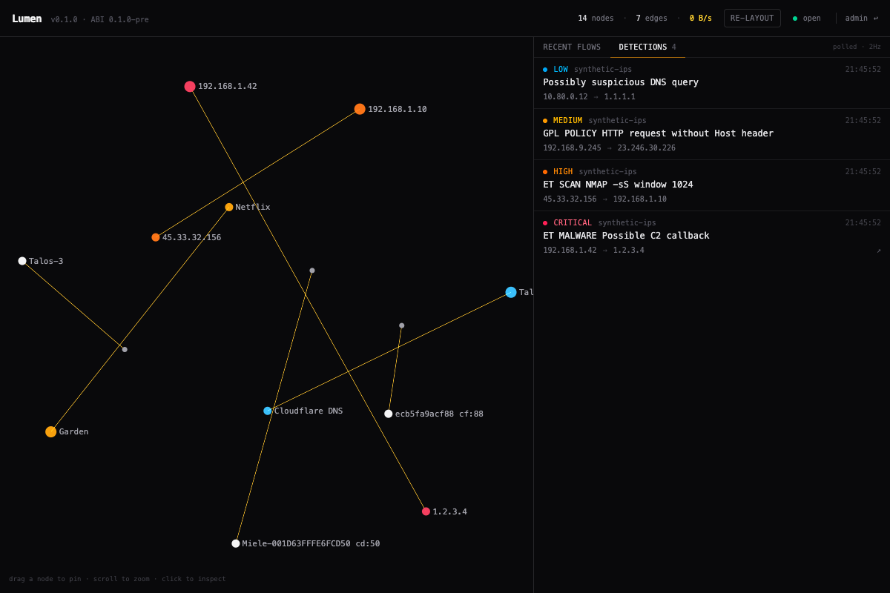
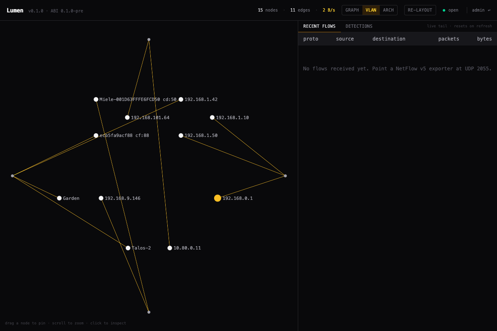
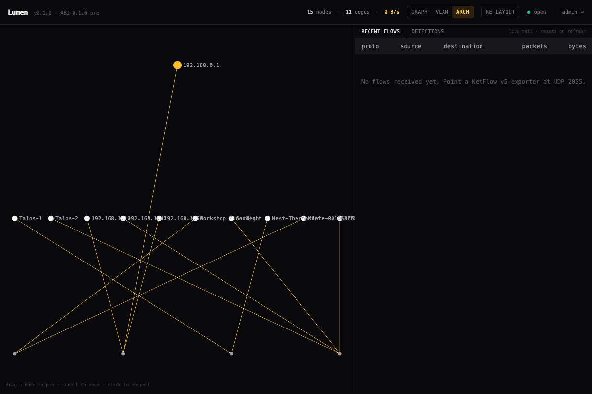
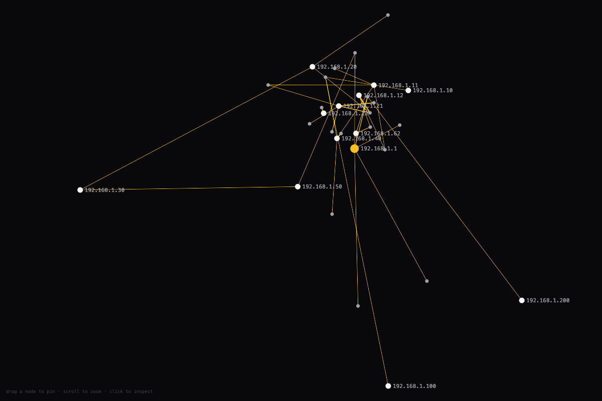
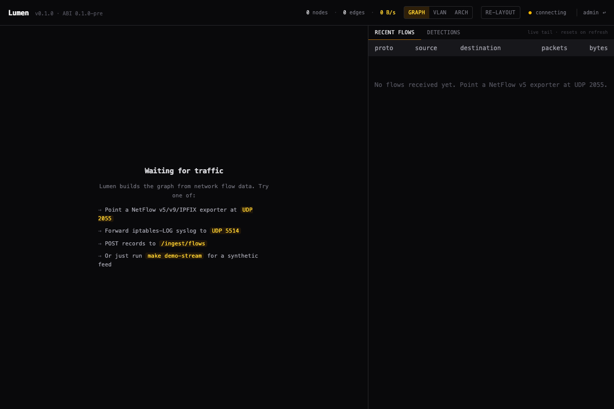

<p align="center">
  <strong>Lumen</strong><br/>
  <sub>Real-time network visualisation for homelab → small enterprise.</sub>
</p>

<p align="center">
  
  
  
  
</p>

<p align="center">
  
</p>

---

## What Lumen is

Lumen turns network flow data — NetFlow v5/v9/IPFIX, iptables-LOG syslog, or arbitrary JSON pushes — into a live, interactive map of your network.

- **Internal devices** show up with names from your UniFi controller (or whatever you've typed in manually). Drag them where they belong; positions persist.
- **External services** auto-cluster as recognisable brands — Google, Netflix, GitHub, Cloudflare, Apple, Microsoft, AWS — driven by a bundled CIDR table.
- **Detection events** from IPS/IDS sources (UniFi, Suricata, anything that can POST ECS-shaped JSON) paint affected nodes in severity colours and stream into a sidebar with click-to-pivot deep links.
- **Three views** of the same data: force-directed graph (default), subnet-grouped VLAN view, or hierarchical architecture view. `⌘1` / `⌘2` / `⌘3`.

Everything runs in a single Rust binary + Docker image. Single-user-friendly homelab install; capability-based RBAC + signed sessions when you need to expose it.

## What Lumen isn't

- **Not a SIEM.** It never persists raw flow records — the system of record stays whatever it already is for you. Lumen surfaces what's happening *right now*.
- **Not enterprise.** No multi-tenancy, no clustering, no policy engine. The bullseye is a homelab with a UniFi gateway; the stretch goal is a small office.

## 60-second install

```bash
git clone https://github.com/jamesagarside/lumen.git
cd lumen
cp .env.example .env
# edit .env — set LUMEN_INITIAL_ADMIN_EMAIL + LUMEN_INITIAL_ADMIN_PASSWORD
make install
make dev
```

**Dev convention for the bootstrap admin** — the scripts in `scripts/` and the `make demo-*` helpers default to:

```text
email:    admin@lumen.test
password: test1234!
```

Set those in `.env` for local work; pick something real for any deployment that lives outside your laptop.

Open <http://localhost:5173>, sign in, then either:

- Point a NetFlow exporter at `UDP 2055`, or
- Forward iptables-LOG syslog to `UDP 5514`, or
- `make demo-stream` for a synthetic feed.

Once you're in, open **⚙ Settings** in the header to wire up UniFi (labels + IPS) and an outbound webhook. Credentials are stored encrypted at rest, no `.env` editing or restart required.

Full dev guide: [DEVELOPMENT.md](./DEVELOPMENT.md).

## Features

### Ingest

- **NetFlow v5** — UDP `:2055`
- **NetFlow v9 + IPFIX** — same port, dispatched by version byte. Templates cached per `(exporter, observation domain)`. Variable-width fields handled.
- **Syslog** with iptables-LOG parsing — UDP `:5514`. UniFi UDM, OPNsense, pfSense, vanilla netfilter.
- **JSON over HTTP** — `POST /ingest/flows` for any source you'd otherwise need a custom collector for.

### Visualisation

- **Sigma.js v3 WebGL graph** — 60fps at A-tier scale (500 nodes / 1000 edges).
- **Three layouts** — Graph (force-directed with semantic anchors), VLAN (subnet clusters), Architecture (hierarchical tiers). `⌘1` / `⌘2` / `⌘3`.
- **Brand classification** — ~60 CIDR entries covering Google / Cloudflare / GitHub / Netflix / Apple / Microsoft / AWS / Akamai / Fastly / Spotify / Twitch and others. Easy to extend.
- **Drag-to-pin** with persisted positions; user edits never get clobbered by integrations.
- **Detection halos** — affected nodes paint in their event's severity colour and force-show their label so alerts are always findable.

| | |
|---|---|
|  VLAN view |  Architecture view |
|  Kiosk mode (`?kiosk=1`) |  First-run empty state |

### Integrations

- **UniFi Network Integration API** (Network ≥ 9.0) — polls clients every 60 s, auto-labels matching nodes with their UniFi names. Survives self-signed TLS. Falls back to user labels.
- **UniFi IPS / IDS alarms** — polls the controller's Threat Management feed every 30 s, dedupes by alarm id, publishes each new alarm as an ECS-shaped detection event (sidebar + node halos + outbound webhook). Uses the legacy cookie-auth path because the Network Integration API doesn't expose alarms yet.
- **Outbound webhook consumer** — every detection event gets POSTed as JSON to `LUMEN_DETECTION_WEBHOOK_URL`. Slack / Discord / n8n / Home Assistant / PagerDuty all accept the same shape.

### Detections

- **ECS-shaped event schema** — verbatim OpenTelemetry semantic-convention field names so downstream SIEMs ingest without translation.
- **In-process bus + ring buffer** — last 500 events, sub-100 ms fanout to UI + webhook consumer.
- **`POST /ingest/events`** for any producer (Suricata, Crowdsec, your own scripts).

### Persistence

- **Topology store** (redb) — device labels, user-set positions, plugin permission grants. Survives restart.
- **Auth store** in the same redb file — Argon2id local users, signed HTTP-only session cookies (7-day TTL), capability-based RBAC.

### Operability

- **OpenMetrics endpoint** at `/metrics` — per-protocol ingest rates, topology size, detection rate, WS clients, eviction counts.
- **OTel-compliant structured logging** — JSON in container, compact in TTY. Set `OTEL_EXPORTER_OTLP_ENDPOINT` to push traces to a collector.
- **Single binary, single image.** `make image && make up` and you have it on a homelab box.

### Auth

- **Local users + Argon2id**, bootstrap admin via env vars.
- **Capability-based RBAC** — `view_graph`, `view_detections`, `edit_device_labels`, `edit_device_positions`, `ingest_flows`, `ingest_detections`, `manage_users`, `manage_settings`.
- **Default roles** — Admin, Operator, Viewer, NocDisplay (the last paired with the kiosk UI variant for wall displays).

### Admin

- **Settings page** (⚙ in the header) — admins manage integration credentials (UniFi labels, UniFi IPS, outbound webhook) from the UI, no `.env` editing or restart required. Save / Clear per integration; live status badges (`running`, `stopped`, `not configured`, `from .env`).
- **Encrypted-at-rest secrets** via ChaCha20-Poly1305 AEAD with a 32-byte master key (auto-generated at `data/master.key`, `0600`; or `LUMEN_MASTER_KEY` env for container deploys). Per-secret random nonces; versioned envelope for future rotation.
- **Env-var fallback** — existing `.env`-configured deployments keep working after upgrade. Env-sourced fields render read-only in the UI with a `from .env` badge. Save once via the UI, delete the env var. DB wins when both are set.

## Architecture

```
                  ┌──────────────────────────────────────────────────┐
   NetFlow  ─┐    │                                                  │
   IPFIX    ─┤    │  Rust daemon (single binary)                     │
   syslog   ─┼──▶ │  ┌─────────┐   ┌──────────────┐  ┌────────────┐  │  WebSocket
   JSON     ─┘    │  │ Ingest  │──▶│ Live State   │─▶│ Snapshot+  │  │  / HTTP
                  │  │ parsers │   │ Engine       │  │ Delta API  │──┼──────────▶  SolidJS UI
   UniFi API ───▶ │  └─────────┘   │ (in-memory)  │  └────────────┘  │              + Sigma.js v3
                  │                └──────┬───────┘                  │
   Detection      │  ┌─────────┐          │                          │
   POSTs       ─▶ │  │Detection│   ┌──────▼───────┐                  │
                  │  │  bus    │   │ Topology     │                  │
                  │  │ +ring   │   │ store (redb) │                  │
                  │  └────┬────┘   │ labels       │                  │
                  │       │        │ positions    │                  │
                  │       ▼        │ users        │                  │
                  │  Webhook       │ sessions     │                  │
                  │  forward       └──────────────┘                  │
                  └──────────────────────────────────────────────────┘
                                       │ /metrics + OTLP /traces
                                       ▼
                            Prometheus / OTel Collector
```

## Roadmap

Shipped:

- Ingest: NetFlow v5/v9/IPFIX, syslog, JSON-HTTP
- Live state engine + topology persistence
- Sigma.js graph with 3 views, brand classification, persistent drag-to-pin
- Detection events: ECS schema, sidebar, severity halos, outbound webhook
- Auth: local users + sessions + RBAC, NOC kiosk mode
- UniFi auto-label integration
- UniFi IPS alarm polling (legacy controller API)
- /metrics, OTLP trace export

Next:

- **OIDC** for federated auth
- **WASM plugin runtime** so integrations can ship out-of-tree
- **Time scrubber** — DAW-style rewind across the rolling raw-flow window
- **Animated dashed edges** — visual hero polish (custom GLSL programs)
- **MAC-aware node identity** — currently nodes are IP-keyed
- **Multi-controller UniFi** support

The full design spec is in [CONTEXT.md](./CONTEXT.md). The full feature backlog is in [GitHub issues](https://github.com/jamesagarside/lumen/issues).

## Family

Lumen is part of the [@jamesagarside](https://github.com/jamesagarside) software family alongside [Helios](https://github.com/jamesagarside/helios). Shared design tokens, shared sensibility, different domains.

## License

[AGPL-3.0](./LICENSE). Use it, extend it, run it for yourself, run it for your team — but if you offer it as a service, contribute your changes back.
